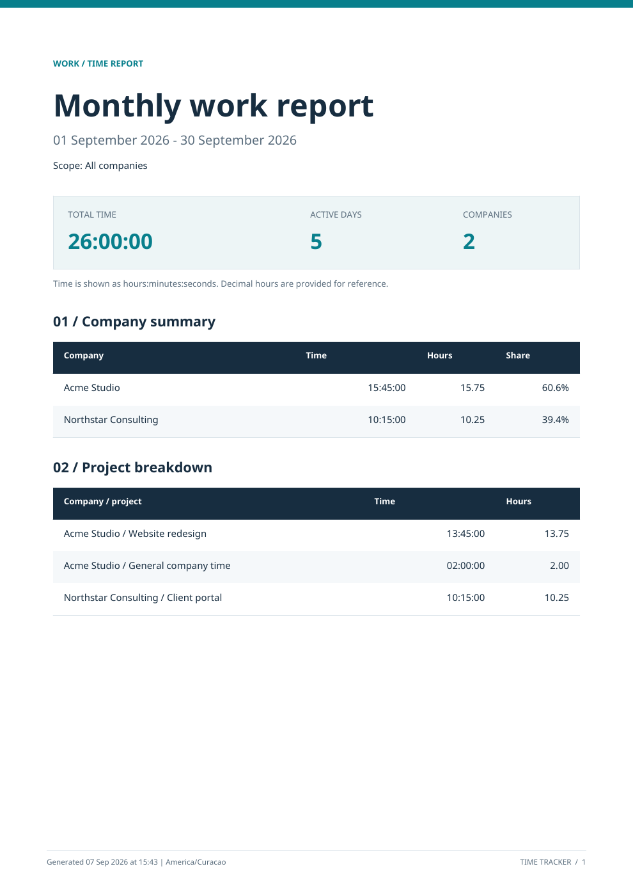

# Time Tracker for Omarchy

Track work by company and project from the Omarchy bar. Start a timer, get back to work, and export a polished PDF when you need to report your hours.



## Features

- Add companies and projects, and save your current selection.
- Start and stop a persistent timer. See elapsed time and the active company directly in the bar.
- Review daily, weekly, monthly, and yearly reports for all companies, one company, or one project.
- Export PDFs with total time, company totals, project breakdowns, daily detail, and page numbers.
- Open the latest PDF directly from the popup.
- Export Markdown reports and session records to an Obsidian vault, and open the exported note.
- Store everything locally in SQLite. No account, cloud service, or Codex installation required.

[View an example PDF](docs/sample-report.pdf) (fictional companies and hours).

## Requirements

- Omarchy Quattro with its Quickshell-based shell and `omarchy plugin` commands. This is not a Waybar module.
- Python 3.10+ with SQLite and timezone data (included in a normal Omarchy installation).
- `python-reportlab` for PDF export. Core tracking works without it.
- `xdg-utils` and an associated PDF viewer for **Open PDF**.
- Optional `noto-fonts` for the PDF's Noto Sans typography and accented Latin names. Otherwise, PDFs use Helvetica.

Install PDF support from the Arch repositories:

```bash
sudo pacman -S --needed python-reportlab noto-fonts
```

The plugin does not download dependencies, run installation hooks, or invoke a package manager. Dependency setup is an explicit user action.

## Install

```bash
omarchy plugin add https://github.com/peterkeating1979-Claw/omarchy-time-tracker --enable
```

Time Tracker appears on the right side of the bar. Click it to open the popup. To move it:

```bash
omarchy bar move peter.time-tracker --section right --index 0
```

## Use

1. Enter a company name and click **Add**.
2. Optionally add a project under that company.
3. Click **Start timer**, then **Stop timer** when finished.
4. Under **Reports**, choose a period and scope. Leave the date blank for the current period, or enter any date within the desired period as `YYYY-MM-DD`.
5. Click **Export PDF**. Exports are saved to `~/Documents/Time Tracker Reports/`; **Open PDF** opens the latest successful export.

**Save selection** remembers the company and project between popup visits. Changing the selection does not move a running timer to another company. Stop it before starting work for someone else.

Only one timer can run at once. It continues while applications are closed or the computer is asleep, until you stop it. No per-second background writes are needed; elapsed time comes from the saved start timestamp.

Weeks start Monday. Monthly and yearly reports use calendar periods. Overnight sessions are split into local days. Active timers are included through the report snapshot time and marked provisional in the PDF. Exports never overwrite an existing file.

## Obsidian export

Under **Obsidian vault** in the popup, enter the full path to your existing local vault folder and click **Save vault**. Choose the same period and company/project scope used for reports, then export Markdown from the CLI if needed (see below). **View Obsidian** opens the most recently logged note, or the saved vault when no note has been logged in this session.

Each export creates a new note in `<vault>/Time Tracker/` with properties, company/project totals, daily detail, and individual session IDs, timestamps, notes, and time within the selected period. Running timers are included as provisional snapshots without being stopped. Re-exporting creates another snapshot; it does not synchronize or overwrite an earlier one.

The vault must already exist and follow the same local storage ownership rules as the database. A symlink at the `Time Tracker` export subfolder is rejected. The plugin does not read your existing notes or change `.obsidian` configuration. **Clear** forgets the saved vault and preserves exported notes. The vault's own sync service may synchronize the new notes according to your existing settings.

No additional Python dependency or Obsidian community plugin is required. Markdown export works while Obsidian is closed; **View Obsidian** requires Obsidian and its `obsidian://` handler to be installed.

Enable **Log each stopped timer to Obsidian** to automatically create one completed-session note whenever you stop the clock, including stops from the CLI or Codex companion. Each note records the company, project (or general company time), start/stop timestamps, duration, timezone, and optional session note. Automatic logging is off by default and requires a saved vault. It applies to future stops, not historical sessions.

New session notes are named `YYYY-MM-DD - Company - Project.md`, using the local stop date. Company-only sessions use `General company time`. Additional records with the same name get `(2)`, `(3)`, and so on. Characters that are unsafe in filenames or Obsidian links are replaced, and very long names are shortened. Existing notes and older queued deliveries retain their names.

The stop and a pending delivery job are saved together before writing to the vault. If the vault is unavailable, the clock remains stopped and the session is retained locally. Use **Retry logging** to deliver pending records (up to 50 per click). Retries also work after a restart and avoid duplicate notes. Pending jobs keep the original vault destination; changing the saved vault does not redirect them. Clearing the saved vault disables future automatic logs but does not delete notes or pending jobs. If a generated note was edited before an interrupted delivery was recorded as complete, the retry preserves it and asks you to move it aside.

```bash
python3 tracker.py vault "$HOME/Documents/My Vault"
python3 tracker.py report monthly --company 'Acme' --obsidian
python3 tracker.py auto-obsidian on
python3 tracker.py retry-obsidian
python3 tracker.py auto-obsidian off
python3 tracker.py vault --clear
```

## Timezone and command line

On first use, the plugin detects an IANA timezone from `TZ` or `/etc/localtime`, falling back to UTC. A previously saved timezone is preserved.

```bash
cd ~/.config/omarchy/plugins/peter.time-tracker
python3 tracker.py timezone America/Curacao
python3 tracker.py status
python3 tracker.py report weekly --company 'Acme' --date 2026-09-07
python3 tracker.py report monthly --company 'Acme' --pdf
python3 tracker.py report yearly --date 2026-01-01 --pdf --output "$HOME/Documents/Time Tracker Reports/work-2026.pdf"
```

Run `python3 tracker.py --help` to list commands. Output is JSON.

## Data and privacy

The SQLite database is stored at `$XDG_DATA_HOME/codex-time-tracker/tracker.sqlite3`, normally `~/.local/share/codex-time-tracker/tracker.sqlite3`. The historical folder name preserves compatibility with the original Codex companion; Codex is not required. `TIME_TRACKER_DB` overrides the database path, and the CLI also accepts `--db PATH` before the command.

The widget polls the local database every five seconds and updates the visible clock every second. It runs the included Python bridge with an argument array, not shell-interpolated company names. **Open PDF** launches `xdg-open` only after a click. The plugin sends no telemetry or work records over the network.

Version 1.0.1 restricts database and SQLite sidecar files to owner read/write (`0600`). The default data folder and new storage directories are private (`0700`). Existing database permissions are tightened on the next successful connection. Database links and non-regular files are rejected. Storage must be in a directory owned by you, with no group/other write access and trusted ancestors. For a temporary database, use a private subdirectory created by `mktemp -d`, not a predictable file directly in `/tmp`.

PDF exports are owner-readable/writable and never follow an existing output symlink. Existing exported PDFs are not retroactively modified. Names are limited to 200 characters, notes to 2,000; control and bidirectional override characters are rejected. Names render as plain text in the popup. See [SECURITY.md](SECURITY.md) for the threat model and reporting instructions.

To back up your records, disable the widget, make sure no tracker CLI command is running, and copy the SQLite file. Enable the widget afterward. Reports and database files are outside the plugin directory and survive updates or removal.

## Update or remove

```bash
omarchy plugin update peter.time-tracker
omarchy plugin disable peter.time-tracker
omarchy plugin remove peter.time-tracker
```

Disabling hides the widget; removal deletes the plugin code. Neither stops an active timer nor deletes records or exported PDFs. Stop the timer first if your work has ended.

If an update leaves an old popup cached, run `omarchy restart shell`.

## Known limits

- There is no editing or deletion of past sessions in this release.
- One active timer is shared across companies and projects.
- Wall-clock corrections affect elapsed time; stopping refuses a timestamp before the session start.
- PDF font coverage depends on installed fonts; complex-script shaping and emoji are not guaranteed.
- The popup uses Qt Quick Controls and the current Omarchy theme.

## Development

Use a test database so development does not create real work records:

```bash
python3 -m venv .venv
.venv/bin/pip install -r requirements-dev.txt
.venv/bin/python -m unittest discover -s tests -v
tracker_demo_dir=$(mktemp -d)
TIME_TRACKER_DB="$tracker_demo_dir/demo.sqlite3" python3 bridge.py '{"args":["status"]}'
omarchy plugin validate .
```

The tests cover persistence, overlapping timers, company/project filters, midnight splitting, DST, calendar boundaries, PDF content, overwrite protection, file permissions, unsafe paths, malformed requests, and input limits. This repository contains source code, tests, and a fictional report preview; it includes no personal database or machine-specific binary dependencies.

## License

MIT. Popup anchoring and bar integration were adapted from Port Watch by Zerubbabel. See [THIRD_PARTY_NOTICES.md](THIRD_PARTY_NOTICES.md).
